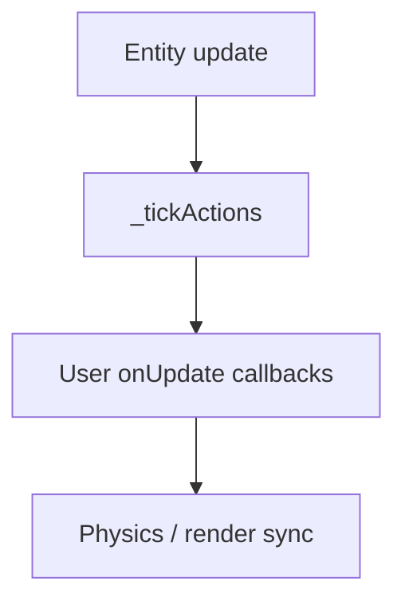

Actions are entity-scoped helpers that change position, rotation, opacity, or timing over frames. Use them for cutscenes, tweens, and small gameplay reactions without writing a full **behavior**. Interval actions finish on their own; persistent actions stay registered until you clear them.

Every entity gets a `transformStore` and an internal action queue. The update loop ticks actions **before** your `onUpdate` callbacks, clears per-frame velocity accumulation, then applies movement from physics.

## Minimal example

Runnable sample: `website/snippets/actions/overview.ts`.

```ts
import { createGame } from '@zylem/game-lib/core';
import { createSphere } from '@zylem/game-lib/entity';
import { moveBy, delay, sequence, onPress } from '@zylem/game-lib/actions';

const coin = createSphere();

coin.runAction(
	sequence(
		moveBy({ y: 2, duration: 600 }),
		delay(200),
		moveBy({ y: -2, duration: 600 }),
	),
);

const press = coin.action(onPress());
coin.onUpdate(({ inputs }) => {
	press.check(inputs.p1.buttons.A.pressed);
	if (press.triggered) {
		coin.runAction(moveBy({ x: 1, duration: 300 }));
	}
});

createGame(coin).start();
```

## runAction vs action

| Method | When it removes | Typical use |
| --- | --- | --- |
| `entity.runAction(action)` | When `action.done` is true | Tweens, sequences, one-shot effects |
| `entity.action(action)` | Never (until `clearActions()`) | Timers, press/release edge detectors |



## Options and variations

- Compose timed steps with [Composition](./composition.md) (`sequence`, `parallel`, `repeat`).
- Per-frame movement helpers (`moveXY`, `rotateY`, …) live on the entity and in `@zylem/game-lib/actions`; see [Movement and rotation](./movement-and-rotation.md).
- React to **game** globals inside `onUpdate` with [Reactive changes](./reactive-changes.md) (`globalChange`, `variableChange` from `@zylem/game-lib/globals`).

## Pitfalls

- Durations for interval factories (`moveBy`, `delay`, …) are in **milliseconds**, while `onUpdate` receives `delta` in **seconds**.
- `moveBy` / `rotateBy` write velocity intent each frame; they need a `transformStore` (all standard entities have one).
- Starting a new `runAction` does not cancel previous actions unless you call `entity.clearActions()`.
- Call `onPress().check(...)` / `onRelease().check(...)` from `onUpdate` **after** the action tick pass; the helper clears `triggered` at the start of each tick.

## API reference

- [Action](/docs/api/actions/interfaces/Action) — base contract (`tick`, `reset`, `done`, `duration`)
- [GameEntity.runAction](/docs/api/entity/interfaces/GameEntity#runaction) — fire-and-forget registration
- [GameEntity.action](/docs/api/entity/interfaces/GameEntity#action) — persistent registration
- Module index: [@zylem/game-lib/actions](/docs/api/actions/)
