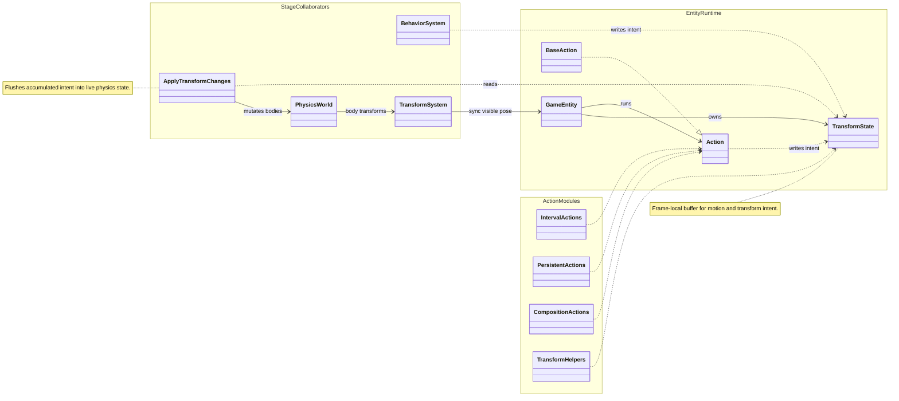

**Action** implementations (interval, persistent, composition helpers) write motion intent into each entity’s **TransformState**. **BehaviorSystem** code can write the same buffer. Each frame, **ApplyTransformChanges** flushes intent into the physics world; **TransformSystem** reads body pose back onto meshes and instanced batches.

