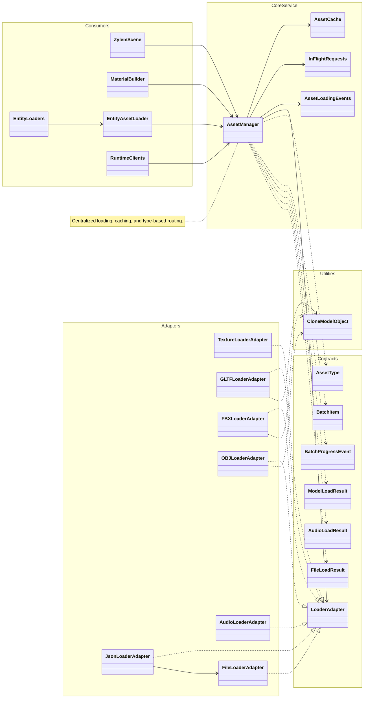

**AssetManager** centralizes typed loading, in-flight deduplication, caching, and progress events. **LoaderAdapter** implementations (textures, glTF/FBX/OBJ, audio, files, JSON) produce typed results; model adapters clone assets through **CloneModelObject**. Scenes, materials, entity loaders, and runtime clients all route requests through the same service.

