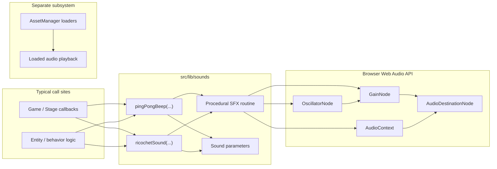

The `src/lib/sounds` helpers (**pingPongBeep**, **ricochetSound**) synthesize short effects through the Web Audio API without touching **AssetManager**. Loaded music and samples use the separate `src/lib/audio` pipeline and asset loaders; the diagram below covers the procedural path only.

