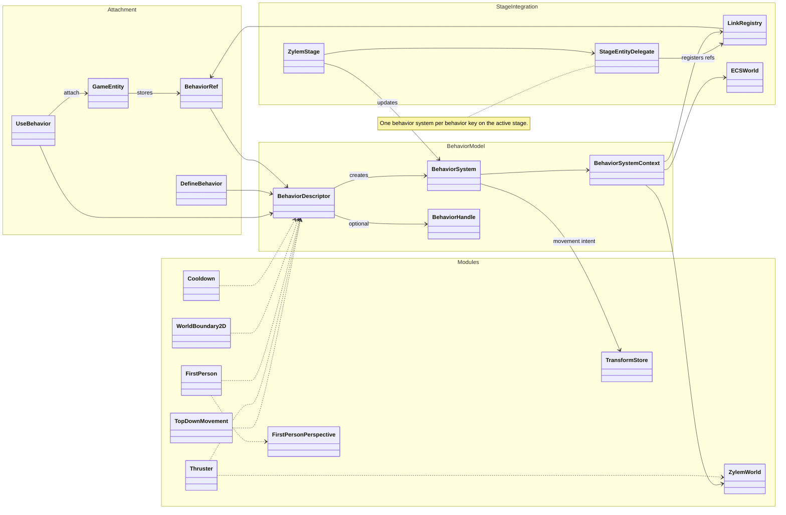

Entities attach gameplay through **BehaviorDescriptor** (`use` / `defineBehavior`), stored as **BehaviorRef** entries. Each descriptor creates a stage-scoped **BehaviorSystem** (one instance per behavior key) with **BehaviorSystemContext** (ECS world, **ZylemWorld**, **LinkRegistry**). Systems read linked entities and write **TransformStore** movement intent alongside actions.

