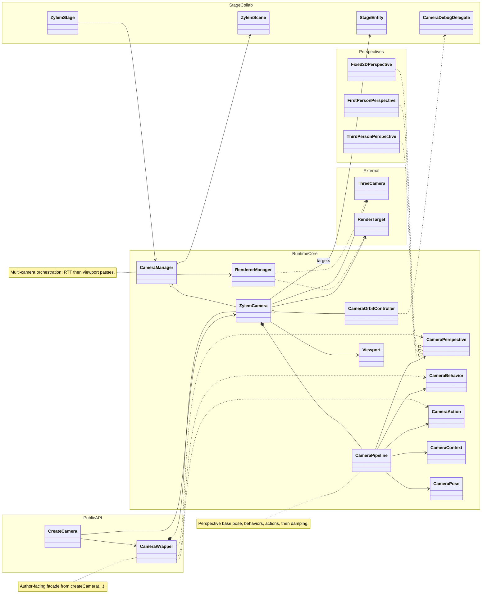

**createCamera** returns a **CameraWrapper** facade over **ZylemCamera**, which owns the Three.js camera, targets, viewport, optional render-to-texture, and a **CameraPipeline**. Each frame the pipeline applies a **CameraPerspective**, ordered **CameraBehavior** modifiers, and transient **CameraAction** effects. **CameraManager** on the stage registers cameras and renders through **RendererManager** (RTT cameras first, then viewport cameras).

