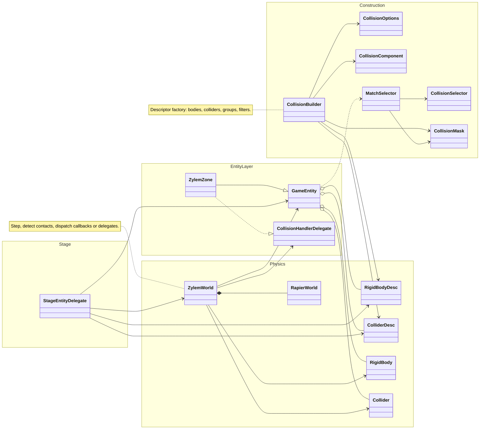

**CollisionBuilder** builds body/collider descriptors, collision groups, and filters. **StageEntityDelegate** reads entity descriptors and attaches live Rapier bodies through **ZylemWorld**. After each step, **ZylemWorld** dispatches contacts on two paths: filtered **GameEntity.onCollision** callbacks, or **CollisionHandlerDelegate** for stateful sensors such as **ZylemZone** enter/held/exit.

