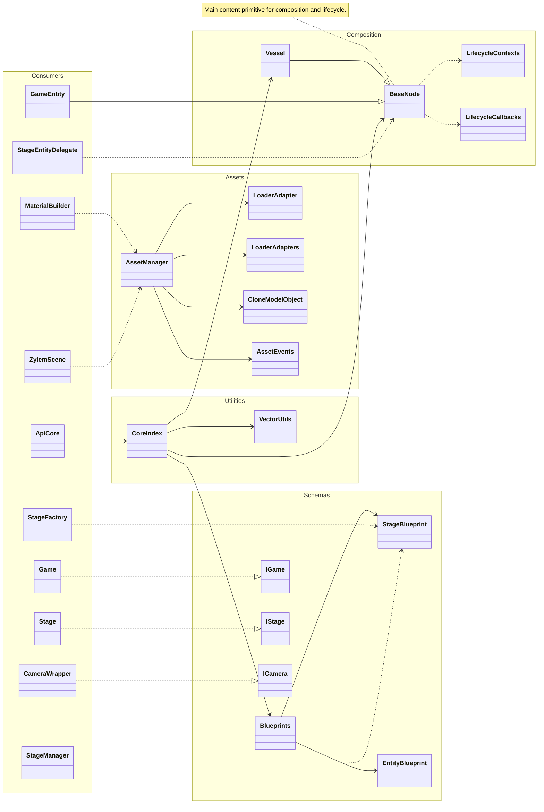

**core** supplies composition primitives (**BaseNode**, **Vessel**), lifecycle hooks, **AssetManager** with loader adapters, JSON **Blueprints**, shared interfaces (**IGame**, **IStage**, **ICamera**), and vector utilities. Stages, entities, scenes, and API barrels consume these types; nothing in core depends on game or stage orchestration.

