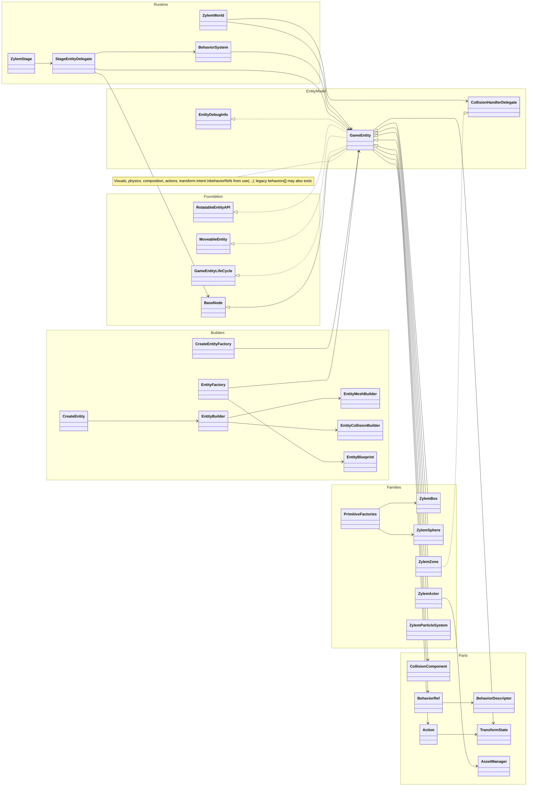

**GameEntity** extends **BaseNode** as the gameplay composition root: mesh/group state, physics descriptors and live bodies, **use(descriptor)** behavior refs, **runAction** / **action**, and **TransformState** for motion intent. Factories (**createEntity**, **EntityBuilder**, **EntityFactory**, primitives, **ZylemActor**) build meshes and colliders; **StageEntityDelegate** and **ZylemWorld** activate entities on the stage.

