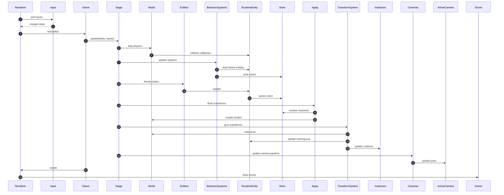

Each animation frame the renderer polls **InputManager**, ticks **Game** → **ZylemStage**, steps physics and behavior systems, runs entity updates, flushes transform intent, syncs poses to visuals and instancing, updates cameras, then renders the active scene.

