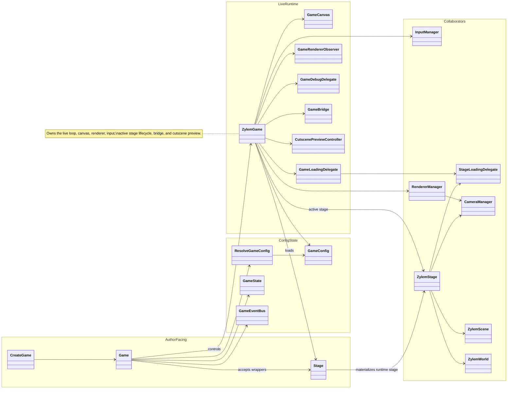

Author code builds a **Game** wrapper (`createGame`) that resolves **GameConfig**, owns **GameState** and the **GameEventBus**, and controls a live **ZylemGame**. The runtime mounts the canvas, wires **InputManager** and **RendererManager**, loads **Stage** wrappers into **ZylemStage**, and coordinates loading delegates. **GameBridge** and cutscene preview hook into **ZylemGame** for editor and Director mode without replacing the engine loop.

