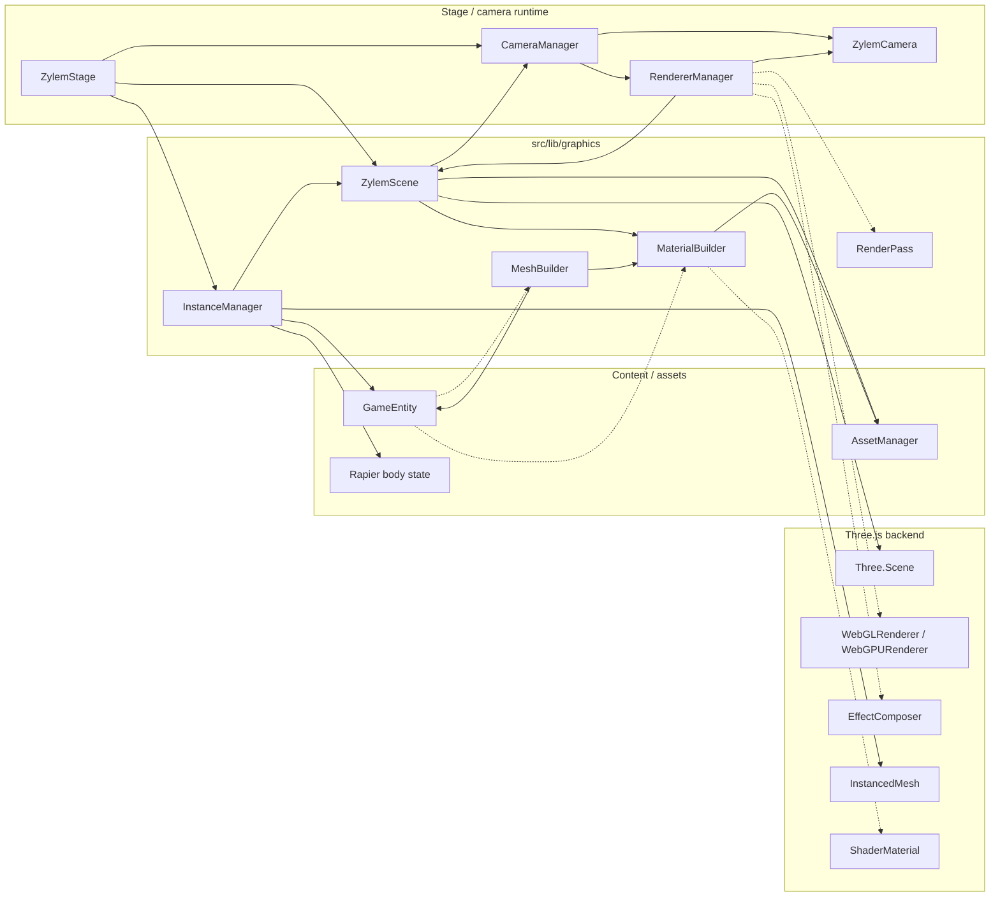

**ZylemStage** owns a **ZylemScene** (Three.js scene, lighting, backgrounds via **MaterialBuilder** and **AssetManager**) and an **InstanceManager** for batched draws. **RendererManager** selects WebGL or WebGPU, owns the canvas renderer, and draws active **ZylemCamera** views—optionally through legacy **RenderPass** or **EffectComposer** post-processing.

