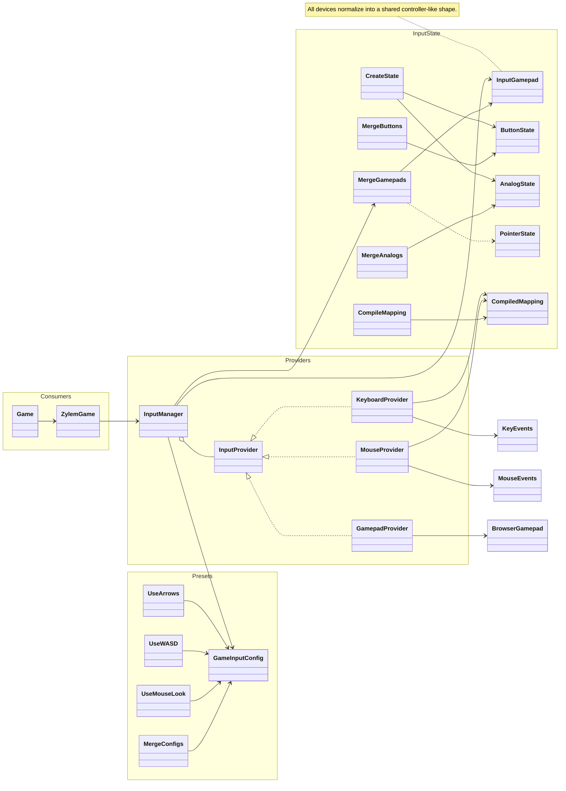

**ZylemGame** owns an **InputManager** that aggregates **InputProvider** implementations (keyboard, mouse, gamepad). Raw DOM events compile into **CompiledMapping** presets (**UseArrows**, **UseWASD**, **UseMouseLook**, merged **GameInputConfig**). All devices normalize into **InputGamepad** with shared button, analog, and pointer fields for gameplay and behaviors.

