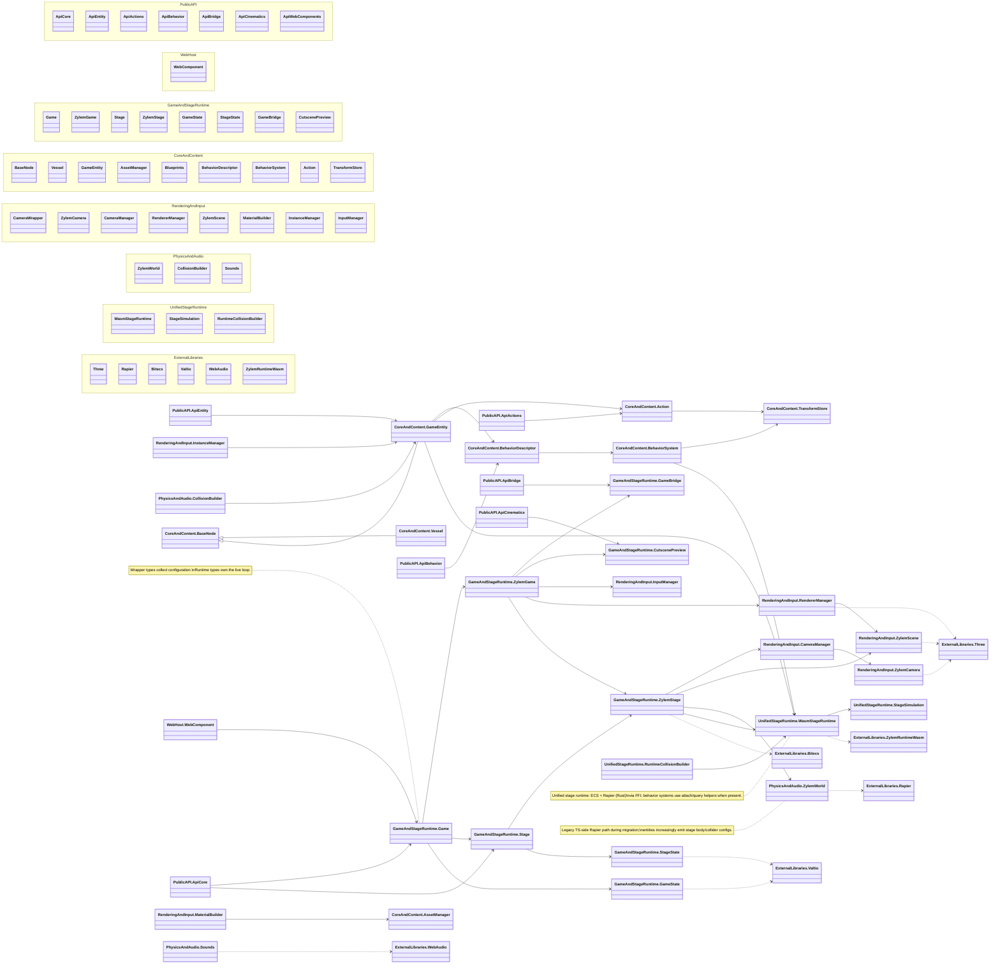

Zylem **game-lib** is organized as published subpath barrels (`src/api`) over implementation modules (`src/lib`), with **game** and **stage** wrappers driving live runtimes (`ZylemGame`, `ZylemStage`). Entities compose behaviors and actions on a shared transform buffer; rendering and input sit on the game loop; physics uses Rapier (TypeScript `ZylemWorld` and/or unified **WasmStageRuntime**). The editor talks to a running game through **GameBridge**; cutscenes use the cinematics stack on top of the camera pipeline.

