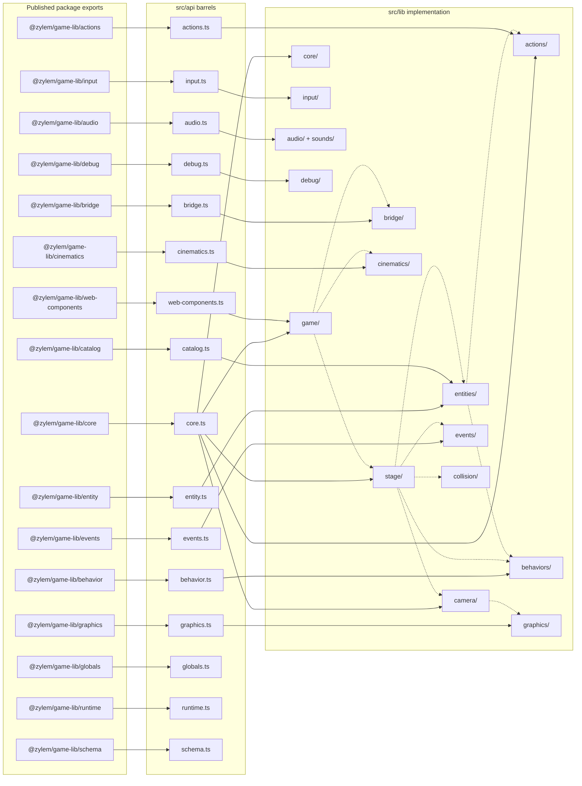

Published imports are **subpath exports** (`@zylem/game-lib/core`, `/entity`, `/bridge`, …). Each `src/api/*.ts` file is a thin barrel that re-exports from `src/lib`; dependency flow is one-way **api → lib**. Prefer focused subpaths over pulling unrelated modules; behavior entrypoints map one file per import path under `@zylem/game-lib/behavior`.

