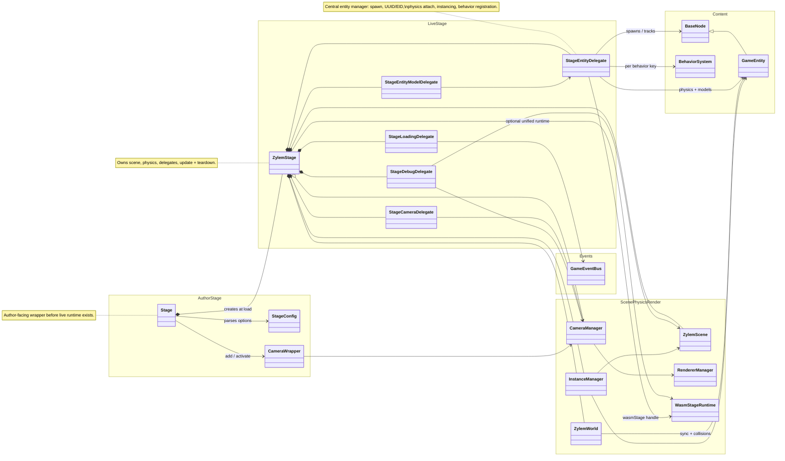

A **Stage** wrapper collects entities, cameras, callbacks, and config before load. **ZylemStage** is the live coordinator: it owns **ZylemScene**, **ZylemWorld**, **InstanceManager**, and focused delegates (entities, cameras, loading, models, debug). **StageEntityDelegate** spawns nodes, maps IDs, attaches physics, registers instancing, and links behavior systems—including **wasmStage** on the unified runtime when present.

