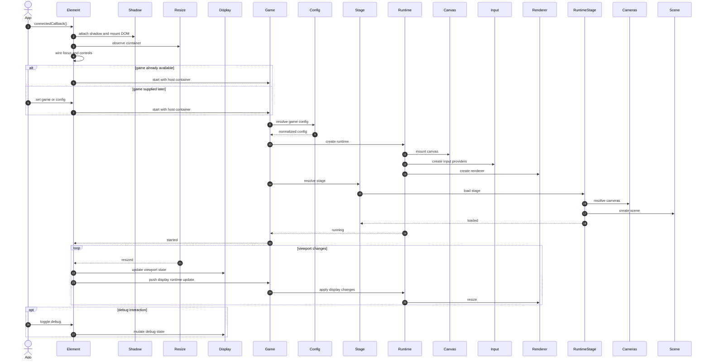

The **zylem-game** custom element attaches a shadow DOM, observes container resize, and starts **Game** / **ZylemGame** when connected or when a game instance is assigned. The runtime mounts canvas, input, and renderer; loads the active **Stage** into **ZylemStage**; forwards viewport changes into display config; optional debug toggles mutate host display state. The element hosts the engine—it does not replace it.

