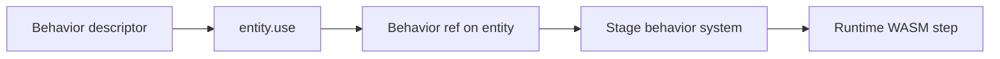

Behaviors attach reusable simulation and gameplay logic to entities through `entity.use(...)`. Import descriptors from `@zylem/game-lib/behavior`; each descriptor wires a stage-scoped system, optional runtime components on the entity, and an optional handle with behavior-specific methods. Use behaviors when movement, combat helpers, boundaries, or presentation hooks belong on the entity rather than in ad hoc `onUpdate` code.

The stack is **game-lib → behaviors → runtime**: game-lib owns entities and the frame loop, `@zylem/behaviors` owns descriptors and simulation-facing components, and `@zylem/runtime` (WASM) executes physics and several high-level controllers. See [Architecture: Behaviors](/docs/architecture/behaviors) for how systems attach at spawn time.

## Minimal example

A complete sample lives in `website/snippets/behaviors/overview.ts`. The pattern is attach, then read the handle and write input each frame:

```typescript
import { createGame } from '@zylem/game-lib/core';
import { createSphere } from '@zylem/game-lib/entity';
import { WorldBoundary2DBehavior } from '@zylem/game-lib/behavior';

const ball = createSphere();
const boundary = ball.use(WorldBoundary2DBehavior, {
  boundaries: { top: 3, bottom: -3, left: -6, right: 6 },
});

ball.onUpdate(({ me, inputs, delta }) => {
  const { Horizontal, Vertical } = inputs.p1.axes;
  let moveX = Horizontal.value * 600 * delta;
  let moveY = -Vertical.value * 600 * delta;
  const clamped = boundary.getMovement(moveX, moveY);
  me.moveXY(clamped.moveX, clamped.moveY);
});

createGame(ball).start();
```

## How a behavior is put together



| Piece | Role |
| --- | --- |
| **Descriptor** | Created with `defineBehavior`; exposes `defaultOptions`, `systemFactory`, and optional `createHandle`. |
| **Handle** | Return value of `entity.use(...)`; base methods include `getOptions()` and `getFSM()`, plus behavior-specific APIs. |
| **Input components** | Prefixed with `$` on the entity (for example `$platformer2D`, `$thruster`); your game writes these from input each frame. |
| **Config / state components** | Unprefixed fields (for example `platformer2D`, `jumper2dState`) hold merged options and runtime state. |
| **FSM** | Optional; use when consumers need discrete modes (`Platformer2DState`, `ScreenWrapState`, …). Not every behavior needs one. |

## Catalog and related pages

- [Coordinators](/docs/behaviors/coordinators) — map one input snapshot into several behaviors.
- [Runtime 2D](/docs/behaviors/runtime-2d) — WASM-only attach markers for classic 2D arcade scenes.
- [Writing a behavior](/docs/behaviors/writing-a-behavior) — author a new descriptor.
- [Behavior catalog](/docs/behaviors/catalog/platformer) — movement, combat, boundaries, VFX, and utilities.

## Taxonomy

**Composable primitives** focus on one job: `CooldownBehavior`, `Shooter2DBehavior`, `WorldBoundary2DBehavior`, `Ricochet2DBehavior`, `ScreenWrapBehavior`, `ScreenVisibilityBehavior`, `TopDownMovementBehavior`, `ThrusterBehavior`, jump helpers (`Jumper2DBehavior`, `Jumper3DBehavior`), `ParticleEmitterBehavior`, `Destructible3DBehavior`, and similar.

**Higher-level controllers** bundle concerns: `Platformer2DBehavior`, `Platformer3DBehavior`, and `FirstPersonBehavior` combine movement, grounding, and camera presentation.

## Pitfalls

- Handles that depend on spawned state (FSM, last hits) return empty values until the entity is spawned and systems have run at least once.
- Prefer behavior handles and input components over duplicating physics math in `onUpdate`.
- WASM-backed behaviors (platformer, top-down, thruster, first-person) expect colliders and a live stage; kinematic helpers such as `WorldBoundary2DBehavior` can clamp manual `moveXY` without a dynamic body.
- Import from `@zylem/game-lib/behavior`, not the root `@zylem/game-lib` barrel.

## API reference

- [`entity.use`](/docs/api) and behavior exports on `@zylem/game-lib/behavior`
- [`defineBehavior`](/docs/api), [`useBehavior`](/docs/api)
- Generated reference: [API](/docs/api)
