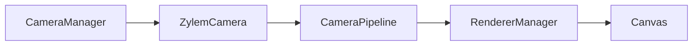

Each **stage** owns one **CameraManager** that registers cameras, decides which ones draw each frame, and coordinates with the shared **RendererManager**. Game code usually works through **CameraWrapper**, the handle returned by `createCamera()`.

A camera combines a Three.js projection (perspective or orthographic), a normalized **viewport** on the canvas, optional **targets** to frame, and a **CameraPipeline** that turns perspective + behaviors + actions into a smoothed pose each frame.

## Minimal stage camera

Pass a `createCamera(...)` wrapper as a stage argument (alongside entities and `stageConfig`). The first camera in the list becomes the stage primary; the manager activates it automatically.

See `website/snippets/camera/third-person-stage.ts` for a runnable pattern: create the camera, pass it to `createStage`, then call `camera.addTarget(me)` in the followed entity’s `onSetup`.

## CameraWrapper responsibilities

| Area | Methods |
| --- | --- |
| Targets | `addTarget`, `removeTarget`, `clearTargets` |
| Viewport | `setViewport(x, y, width, height)` — fractions 0–1 |
| Pipeline | `addBehavior`, `removeBehavior`, `addAction`, `setPerspective`, `getPerspective`, `getState` |
| Debug orbit | `enableOrbitalControls`, `disableOrbitalControls` |
| Offscreen | `getRenderTexture()` when created with `renderToTexture` |

`CameraOptions` at construction time mirror most of this: `perspective`, `position`, `target`, `zoom` (2D), `viewport`, `damping`, `behaviors`, `renderToTexture`, `useOrbitalControls`, and `skipDebugOrbit` (keep pipeline control when the editor debug orbit is active — important for first-person mouse look).

## Multi-camera and split view

`CameraManager` keeps a named registry. The first registered camera is primary; additional cameras can stay active for picture-in-picture or split screen via `addActiveCamera`. Each camera’s `viewport` selects the region of the canvas it renders into.

When only one fullscreen camera is active, the renderer may route the frame through the TSL post-processing pipeline (see [Renderers](/docs/rendering/renderers)). Multiple viewports use direct per-camera renders instead.

## Debug camera

The manager always creates a hidden `__debug__` camera with orbit controls for editor/debug mode. It is registered but not activated during normal gameplay. Enabling debug swaps the active list to the debug camera while preserving the previous primary in `preDebugPrimary`.

## Frame flow

Unless orbital/debug controls override the pipeline, each active camera runs: **perspective base pose → behaviors → action deltas → damping → commit to Three.js camera**.

## Pitfalls

- **Targets vs behaviors**: Built-in perspectives read `CameraContext.targets` (`primary` is the first `addTarget` entity). Extra framing logic belongs in behaviors such as [createFollowTarget](/docs/camera/pipeline-behaviors-and-actions).
- **First frame snap**: Changing perspective or toggling debug orbit resets smoothing so the camera does not lerp from the origin.
- **Post-processing**: Effects configured on the stage apply only when a single fullscreen camera renders that frame.

## API reference

- [createCamera](/docs/api/core/functions/createCamera), [CameraWrapper](/docs/api/core/classes/CameraWrapper), [CameraOptions](/docs/api/core/interfaces/CameraOptions)
- [CameraManager](/docs/api/core/classes/CameraManager), [Viewport](/docs/api/core/interfaces/Viewport), [isWebGPUSupported](/docs/api/core/functions/isWebGPUSupported)
- [CameraPipeline](/docs/api/core/classes/CameraPipeline), pipeline types under [core](/docs/api/core)
