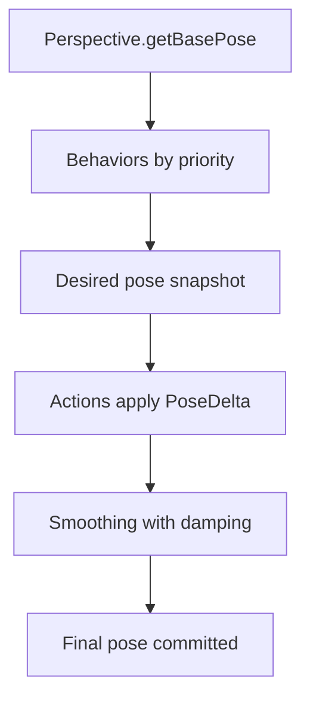

The **CameraPipeline** is the deterministic per-frame sequence that turns tracking context into the Three.js camera transform. `CameraWrapper` delegates to the pipeline on the underlying `ZylemCamera`.

## Pipeline order



1. **Perspective** — base pose from the active `CameraPerspective`.
2. **Behaviors** — keyed modules, sorted by ascending `priority` (lower runs first). Disabled behaviors (`enabled: false`) are skipped.
3. **Desired pose** — stored for debug (`getState().desiredPose`).
4. **Actions** — transient **additive** deltas (`PoseDelta`: position, rotation, fov, zoom). Removed when `isDone()` returns true.
5. **Smoothing** — lerps from the previous final pose using `damping` (0 = frozen, 1 = snap). First run after attach snaps to avoid lerping from world origin.

When **orbital or debug orbit controls** are active, the pipeline is bypassed and manual control drives the Three.js camera directly.

## CameraContext

Every pipeline step receives:

- `dt` — frame delta in seconds
- `time` — elapsed time since the camera started updating
- `viewport` — pixel width, height, and aspect
- `targets` — map of named transforms; index `0` from `addTarget` is always `primary`, further targets are `target_1`, `target_2`, …

Perspectives and behaviors should read targets through `targetKey` (default `'primary'`).

## Behaviors

Behaviors are **idempotent by key**: `camera.addBehavior('follow', behavior)` replaces any prior `'follow'` entry and calls `onDetach` / `onAttach` when provided.

### createFollowTarget

Built-in follow behavior that lerps **position** toward `target.position + offset` and sets `lookAt` to the target. It does not override FOV, zoom, or rotation from the perspective.

```ts
camera.addBehavior(
	'follow',
	createFollowTarget({
		targetKey: 'primary',
		offset: { x: 0, y: 3, z: 8 },
		lerpFactor: 0.1,
	}),
);
```

You can also pass `behaviors: { follow: createFollowTarget(...) }` in `createCamera` options. See `website/snippets/camera/follow-behavior.ts`.

Implement custom behaviors with the `CameraBehavior` interface: `update(ctx, pose) => pose`, optional `priority`, `enabled`, `onAttach`, `onDetach`.

## Actions

Actions implement `CameraAction`: `update(ctx) => PoseDelta` and `isDone(ctx) => boolean`. There are no bundled shake/recoil actions in game-lib yet; add your own and register with `camera.addAction(action)`.

Actions run **after** behaviors and **before** smoothing, so a shake delta is still damped unless `damping` is 1.

Example shape (inline fragment):

```ts
let elapsed = 0;
camera.addAction({
	update(ctx) {
		elapsed += ctx.dt;
		const strength = Math.max(0, 1 - elapsed / 0.3);
		return {
			position: new Vector3(
				(Math.random() - 0.5) * strength,
				(Math.random() - 0.5) * strength,
				0,
			),
		};
	},
	isDone() {
		return elapsed >= 0.3;
	},
});
```

## Inspecting state

`camera.getState()` returns `CameraPipelineState`: active `perspectiveId`, desired/final poses, behavior keys, and active action count. Useful for debug overlays and tests.

## Pitfalls

- **Behavior vs perspective**: Do not duplicate framing in both; let the perspective handle baseline third-person math and use behaviors for offsets or alternate tracking.
- **Action expiration**: Forgetting `isDone()` leaks actions every frame.
- **Debug orbit**: Custom FPS control requires `skipDebugOrbit: true` on the camera options.

## API reference

- [CameraPipeline](/docs/api/core/classes/CameraPipeline)
- [CameraBehavior](/docs/api/core/interfaces/CameraBehavior), [CameraAction](/docs/api/core/interfaces/CameraAction), [CameraPose](/docs/api/core/interfaces/CameraPose), [PoseDelta](/docs/api/core/interfaces/PoseDelta), [CameraContext](/docs/api/core/interfaces/CameraContext), [CameraPipelineState](/docs/api/core/interfaces/CameraPipelineState)
- [createFollowTarget](/docs/api/core/functions/createFollowTarget), [FollowTargetOptions](/docs/api/core/interfaces/FollowTargetOptions)
