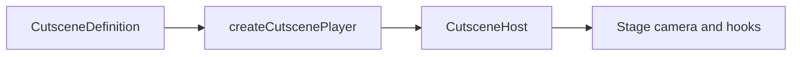

Cutscenes are timeline-driven sequences: scenes with picture transitions, camera tracks (static, dolly, or follow shots), and optional event and audio tracks that hook into gameplay. Creator’s Director mode authors `.cutscene.json` files; `@zylem/game-lib/cinematics` plays them against a live stage camera and fires stage events, variables, animations, and audio at scheduled times.

## Main pieces

| Piece | Role |
| --- | --- |
| `CutsceneDefinition` | Serializable timeline (scenes, cameras, dollies, tracks) |
| `createCutscenePlayer` | Playhead, camera pose evaluation, event/audio firing |
| `createStageCutsceneHost` | Default host: stage camera, entities by name, songs (Tone), SFX (Howler), transitions |
| `CutsceneCameraBehavior` | Pipeline behavior that applies evaluated poses each frame |
| `CutscenePreviewController` | Bridge-driven preview inside `ZylemGame` for Director mode |
| `cutscene-math` | Scene/shot lookup, dolly paths, easing, `evaluateCutscene` |

## Camera kinds

- **static** — holds `pose` or interpolates keyframes
- **dolly** — moves along a `DollyPath` (Catmull–Rom) over the shot duration
- **follow** — tracks a named entity with optional offset and damping

Camera shots sit on a **camera** track; blends between shots can smooth position, look-at, and FOV.

## Event and audio tracks

**Event** items dispatch structured events (`emit`, `playAnimation`, `playSong`, `stopSong`, `setVariable`) through the host.

**Audio** items play a song reference or SFX URL with volume and loop flags. The stage host resolves songs via `resolveSong` in `StageCutsceneHostOptions`.

## Scene transitions

Each scene has a `transitionIn` (`cut`, `fade`, `wipe`, `radial`, `noise`, `cells`) with duration and easing. Register blend shaders once with `setCutsceneTransitionShaders` (for example from `@zylem/shaders`); otherwise non-`cut` transitions fall back to a crossfade.

## Where to go next

- [Cutscene definition](./cutscene-definition.md) — schema fields and tracks
- [Playing cutscenes](./playing-cutscenes.md) — `createCutscenePlayer` and hosts
- [Previewing in the editor](./previewing-in-editor.md) — bridge messages and `CutscenePreviewController`

## API reference

- [`CutsceneDefinition`](/docs/api/cinematics/type-aliases/CutsceneDefinition)
- [`createCutscenePlayer`](/docs/api/cinematics/functions/createCutscenePlayer)
- [`createStageCutsceneHost`](/docs/api/cinematics/functions/createStageCutsceneHost)
- [`CutscenePreviewController`](/docs/api/cinematics/classes/CutscenePreviewController)
