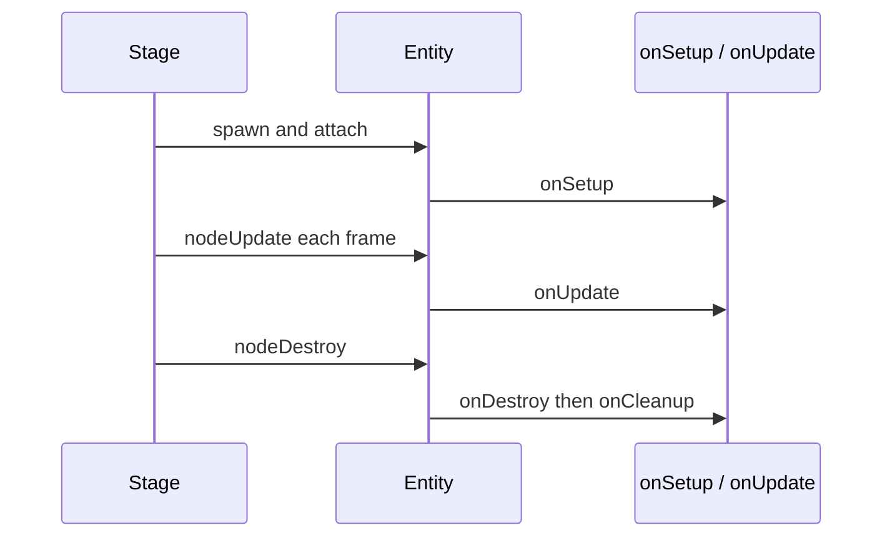

An **entity** is a `GameEntity` instance you construct with factories from `@zylem/game-lib/entity`, then pass into [createGame](/docs/api/core/functions/createGame) or [createStage](/docs/api/core/functions/createStage). Each entity owns transform state, optional mesh and collider parts, lifecycle hooks, collision callbacks, and attachment points for [behaviors](/docs/behaviors/overview). Use entity factories when you need something visible, physical, or interactive in a **stage**; the game loop calls your hooks and syncs poses to Three.js each frame.

## Minimal example

The runnable sample is in `website/snippets/entities/overview.ts`:

```typescript
import { createGame } from '@zylem/game-lib/core';
import { createBox } from '@zylem/game-lib/entity';

const crate = createBox({
  name: 'crate',
  size: { x: 1, y: 1, z: 1 },
  position: { x: 0, y: 0.5, z: 0 },
});

crate.onSetup(({ me }) => {
  me.reveal();
});

crate.onUpdate(({ me, delta }) => {
  me.rotateY(delta * 0.5);
});

createGame(crate).start();
```

## Lifecycle

Entities inherit lifecycle registration from the shared node base type (`BaseNode` in game-lib). Register callbacks before `start()`; the stage invokes them in a fixed order during spawn, load, update, and teardown.

| Hook | When it runs | Typical use |
| --- | --- | --- |
| `onSetup` | After the entity is wired into the stage, before the first update | Cache handles, `stage.getEntityByName`, camera targets |
| `onLoaded` | After async assets for loadable entities finish | Start animations, flip UI state |
| `onUpdate` | Every frame (after internal action ticks) | Input, gameplay, `moveXY` |
| `onDestroy` | User teardown begins | Score, audio, game logic cleanup |
| `onCleanup` | Engine resource disposal | Rare in game code; entities like text use this internally |

Context objects match [SetupContext](/docs/api/core/interfaces/SetupContext), [UpdateContext](/docs/api/core/type-aliases/UpdateContext), and related types in the core module. Every update callback receives `me`, `delta`, `inputs`, `globals`, `camera`, and optional `stage` / `game`.



## Shared options

Most factories accept [GameEntityOptions](/docs/api/entity/type-aliases/GameEntityOptions):

- **name** — used with `getEntityByName` on the [createStage](/docs/api/core/functions/createStage) handle and for editor selection.
- **position**, **size**, **color** — transform and appearance defaults (exact fields vary by factory).
- **collision** — Rapier body flags (`static`, `sensor`, locks, CCD, and related fields).
- **material** — shader and texture overrides from the graphics layer.
- **hideUntilPositioned** — spawn visibility when a spawner sets pose after creation.
- **visible** / **reveal()** — explicit render visibility control.

Entities created by official factories support [clone()](/docs/api/entity/interfaces/GameEntity#clone) with optional overrides for spawners and templates.

## Factory map

| Kind | Factories | Doc page |
| --- | --- | --- |
| Primitives | `createBox`, `createSphere`, `createPlane`, … | [Primitives](/docs/entities/primitives) |
| Composition | `create`, `boxMesh`, `boxCollision`, … | [Composable entities](/docs/entities/composable-entities) |
| Skinned models | `createActor` | [Actors and models](/docs/entities/actors-and-models) |
| 2D art and labels | `createSprite`, `createText` | [Sprites and text](/docs/entities/sprites-and-text) |
| Triggers | `createZone` | [Zones and triggers](/docs/entities/zones-and-triggers) |
| Scene atmosphere | `createLight`, `createFog` | [Lights and fog](/docs/entities/lights-and-fog) |
| VFX and debug draw | `createParticleSystem`, `createLine` | [Particles and lines](/docs/entities/particles-and-lines) |
| HUD | `createRect`, `createCooldownIcon` | [UI elements](/docs/entities/ui-elements) |
| Lookup and removal | `destroy`, type symbols | [Lookup and destroy](/docs/entities/lookup-and-destroy) |

## Pitfalls

- Construct entities and call `use()` / lifecycle hooks **before** `start()`. Do not assume a WebGL context exists at module load time.
- Prefer **behaviors** for reusable simulation rules; use `onUpdate` for entity-specific glue code.
- Default spawn visibility hides new entities until spawn finalizes; call `reveal()` or set `hideUntilPositioned: false` when you control placement manually.
- Import from `@zylem/game-lib/entity`, not the root `@zylem/game-lib` barrel.

## API reference

- [GameEntity](/docs/api/entity/interfaces/GameEntity)
- [GameEntityOptions](/docs/api/entity/type-aliases/GameEntityOptions)
- [Entity module index](/docs/api/entity)
