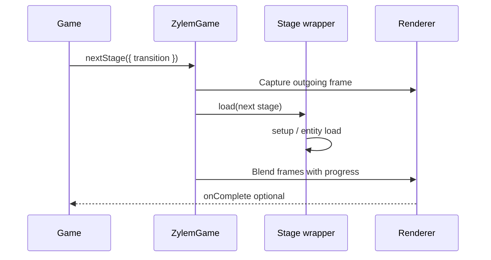

Games with multiple `createStage` instances can move between them at runtime. Navigation methods load another stage’s scene, re-run setup when the game has already started, and optionally crossfade (or custom-shade) from the outgoing frame to the incoming one.

## Minimal example

```ts
import { createGame, createStage, gameConfig } from '@zylem/game-lib/core';

const menu = createStage({ backgroundColor: '#111111' });
const level = createStage({ backgroundColor: '#222222' });

const game = createGame(gameConfig({ id: 'nav-demo' }), menu, level);

void game.start().then(() => {
  game.nextStage({ transition: { duration: 0.8, easing: 'easeInOut' } });
});
```

Sample: [`website/snippets/game-and-stages/navigation-and-transitions.ts`](../../snippets/game-and-stages/navigation-and-transitions.ts).

## Array-based navigation

When stages are listed in `createGame`:

| Method | Behavior |
| --- | --- |
| `nextStage(options?)` | Load the next stage in the array |
| `previousStage(options?)` | Load the previous stage |
| `reset(options?)` | Reload the first stage |

Each method accepts optional **`StageNavigationOptions`**: `{ transition?: StageTransitionConfig }`.

Calls are ignored while a stage load is already in flight (`isLoading()`), which prevents double navigation from input during transitions.

## Blueprint navigation

For saved or registered stages, the engine exposes **`StageManager`** and **`stageState`** (reactive previous / current / next blueprints):

- **`StageManager.registerStaticStage(id, blueprint)`** — seed read-only stage data
- **`StageManager.loadStageData(stageId)`** — load from IndexedDB save or static registry
- **`StageManager.transitionForward(nextStageId)`** — shift the sliding window and persist the outgoing blueprint
- **`StageManager.preloadNext(stageId)`** — set `stageState.next` ahead of time

**`game.loadStageFromId(stageId)`** loads blueprint data, builds a `Stage` via `StageFactory.createFromBlueprint`, and mounts it. When `stageState.next` is set, `nextStage()` prefers the manager path before falling back to the in-memory stage array.

## Transition configuration

`StageTransitionConfig` (from `@zylem/game-lib/core`) controls the visual blend during `nextStage`, `previousStage`, and `reset`:

| Field | Default | Description |
| --- | --- | --- |
| `duration` | `0.8` (seconds) | Blend length |
| `shader` | Built-in crossfade | `ZylemTransitionShader` or `{ shader }` wrapper; compatible with `@zylem/shaders` transition helpers |
| `easing` | `'easeInOut'` | `'linear'`, `'easeInOut'`, or a custom `(t) => number` |
| `onComplete` | — | Callback after the blend finishes |

`crossfadeTransitionShader` is exported for reuse or testing.

```ts
import { crossfadeTransitionShader } from '@zylem/game-lib/core';

game.nextStage({
  transition: {
    duration: 1.2,
    shader: crossfadeTransitionShader,
    onComplete: () => console.log('arrived'),
  },
});
```

Fancy wipes/noise patterns typically come from `@zylem/shaders` (`createStageTransition(...).shader`) without adding a hard dependency in game-lib.

## Flow (array navigation)



## Pitfalls

- **`goToStage()` and `end()`** are placeholders—do not use them yet.
- Calling `nextStage` on the last array entry (or `previousStage` on the first) logs an error and no-ops.
- Blueprint loading throws if an id is missing from storage and the static registry; register stages or save before relying on ids.
- Transition shaders need both stages to render through the shared `RendererManager`; exotic multi-camera setups may need a cut instead of a blend.

## API reference

- [Game.nextStage](/docs/api/core/classes/Game#nextstage)
- [Game.previousStage](/docs/api/core/classes/Game#previousstage)
- [Game.reset](/docs/api/core/classes/Game#reset)
- [Game.loadStageFromId](/docs/api/core/classes/Game#loadstagefromid)
- [StageNavigationOptions](/docs/api/core/interfaces/StageNavigationOptions)
- [StageTransitionConfig](/docs/api/core/interfaces/StageTransitionConfig)
- [crossfadeTransitionShader](/docs/api/core/variables/crossfadeTransitionShader)
- [StageManager](/docs/api/core/variables/StageManager)
- [stageState](/docs/api/core/variables/stageState)
