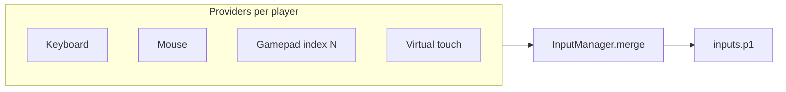

Input is normalized into up to eight local players (`p1` … `p8`). Each player receives an `InputGamepad` shape: face buttons, directions, shoulder triggers, four analog axes, and optional pointer fields. Keyboard, mouse, touch overlays, and physical gamepads all merge into that single structure so gameplay code can stay device-agnostic.

Configure providers through `GameInputConfig` on the **game** (`createGame(...).setInputConfiguration(...)`) or per **stage** (`stage.setInputConfiguration(...)`). Later configs deep-merge; see [Presets](./presets.md).

## Minimal example

Runnable sample: `website/snippets/input/overview.ts`.

```ts
import { useWASDForAxes } from '@zylem/game-lib/input';

player.onUpdate(({ me, inputs, delta }) => {
	const pad = inputs.p1;
	const speed = 450 * delta;
	me.moveXY(pad.axes.Horizontal.value * speed, -pad.axes.Vertical.value * speed);
});

createGame(player).setInputConfiguration(useWASDForAxes('p1')).start();
```

## InputGamepad layout



| Field | Meaning |
| --- | --- |
| `buttons.A/B/X/Y/...` | Digital actions with `pressed`, `released`, `held` (seconds) |
| `directions.Up/Down/Left/Right` | D-pad style |
| `shoulders.LTrigger/RTrigger` | Analog triggers as buttons |
| `axes.Horizontal/Vertical` | Primary stick (−1 … 1) |
| `axes.SecondaryHorizontal/SecondaryVertical` | Second stick or mouse look |
| `pointer` | Normalized cursor (mouse provider) |

Read input in `entity.onUpdate(({ inputs }) => ...)`. Type payloads with `Inputs`, `InputGamepad`, and `ButtonState` from `@zylem/game-lib/input`.

## Defaults for player 1

If you do not pass custom keyboard config, player 1 gets a built-in keyboard map (arrows for directions, `z/x/a/s` for face buttons, and so on). Other players only receive keyboard/mouse/touch providers when you add config entries for them. A `GamepadProvider` is always attached per player index.

## Pitfalls

- Axis values are −1 … 1; multiply by speed and `delta` for frame-rate-independent motion.
- `pressed` is true only on the first frame of a hold; use `held` or edge helpers from [Persistent actions](../actions/persistent-actions.md) for repeat-fire.
- Pointer lock requires a user gesture in the browser; handle focus on the game canvas.

## API reference

- [Inputs](/docs/api/input/type-aliases/Inputs)
- [InputGamepad](/docs/api/input/interfaces/InputGamepad)
- [ButtonState](/docs/api/input/interfaces/ButtonState)
- [AnalogState](/docs/api/input/interfaces/AnalogState)
- Module index: [@zylem/game-lib/input](/docs/api/input/)
