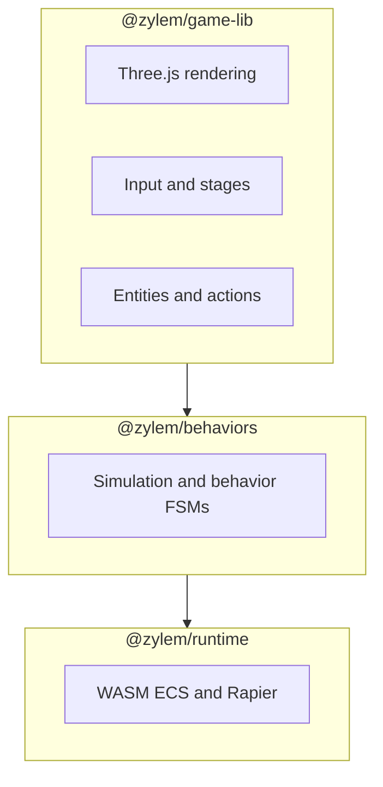

Zylem is a TypeScript framework for building small 3D games and interactive scenes in the browser. You describe a **game** (loop, input, assets), one or more **stages** (scenes), and **entities** with **behaviors** and **actions**—without a heavyweight editor. Rendering uses Three.js; physics and collision run in WebAssembly through Rapier, coordinated by `@zylem/behaviors` and `@zylem/runtime`.

Use Zylem when you want code-first 3D on the web: hobby projects, prototypes, or teaching. It fits Vite (or any bundler), or you can host the canvas inside the `<zylem-game>` custom element when embedding in a larger app or the Zylem editor.

## How the stack fits together

Zylem ships as layered packages. Most games import only `@zylem/game-lib` subpaths (`/core`, `/entity`, `/behavior`, and so on):

Each frame, game-lib forwards behavior inputs into the simulation, advances fixed-timestep physics in WASM, then syncs poses back onto Three.js objects. You rarely touch the runtime directly; for advanced debugging, `game.experimental.getRuntime()` exposes the underlying simulation.

## Where to go next

1. [Installation](/docs/getting-started/installation) — add `@zylem/game-lib` to your project.
2. [Your first game](/docs/getting-started/your-first-game) — move a sphere with arrow keys and keep it inside a 2D boundary.
3. [Project setup](/docs/getting-started/project-setup) — Vite, `createGame().start()`, or `<zylem-game>`.
4. [Core concepts](/docs/getting-started/core-concepts) and the [Glossary](/docs/getting-started/glossary) — shared vocabulary for the rest of the guide.

Live demos are hosted at [zylem.onrender.com](https://zylem.onrender.com). The project is still in **alpha**; APIs may change.

## API reference

- [API index](/docs/api) — generated TypeDoc reference for all public modules.
- [createGame](/docs/api/core/functions/createGame) — construct a game instance.
- [Game.start](/docs/api/core/classes/Game#start) — load assets and begin the loop.
