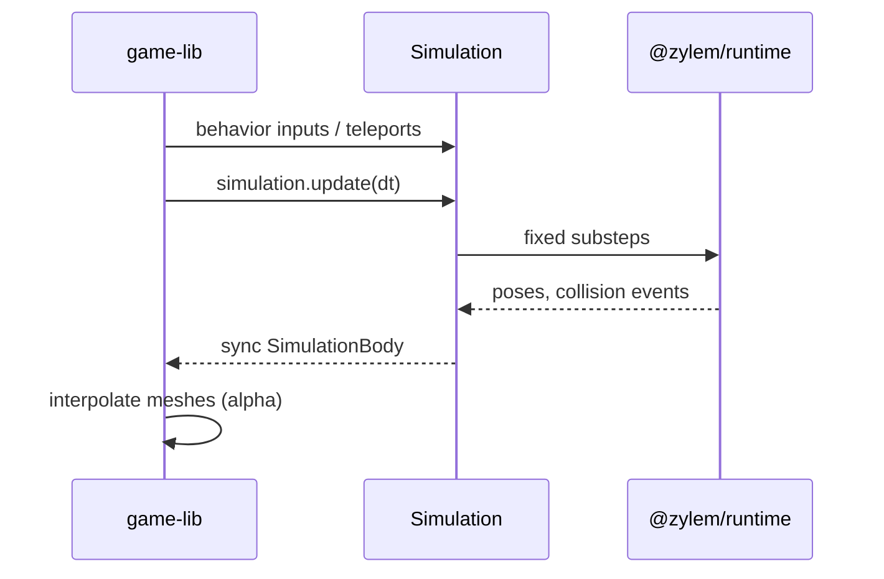

Zylem physics follows the fixed layer stack **game-lib → behaviors → runtime**:

| Layer | Package | Role in physics |
| --- | --- | --- |
| game-lib | `@zylem/game-lib` | Entity collider factories, `ZylemWorld`, collision callbacks, render interpolation |
| Simulation | `@zylem/behaviors` | `createSimulation()`, spawn/update/dispose, event translation |
| Runtime | `@zylem/runtime` (WASM) | Rapier-backed ECS, fixed timestep, debug render buffers |

Games normally never import WASM directly. Entity factories attach **collision components**; the stage **world** uploads body/collider definitions and steps simulation each frame.

## Per-frame flow

After physics, `ZylemWorld.interpolationAlpha` drives visual smoothing between the last and current fixed steps.

## Stage world

Each loaded stage constructs `ZylemWorld` with gravity and `physicsRate` (Hz, default 60) from `stageConfig`. `createSimulation({ gravity, fixedTimestep, initialCapacity })` boots WASM.

Entities with collision components call `world.addEntity` on spawn, which maps uuid ↔ simulation handles and registers colliders.

## Zero-gravity 2D conventions

When gravity is `(0,0,0)`, new bodies default to **locked translation and rotation** unless options override — matching arcade 2D where motion is code-driven. **Actors** and controlled entities also lock rotation to prevent tipping.

## Simulation access

`game.experimental.getRuntime()` returns the current stage’s `Simulation | null` for editor tooling or diagnostics. Treat it as unstable; gameplay should use entity APIs and behaviors instead.

## Pitfalls

- **Event cost**: Collision event collection stays disabled until the first `onCollision` registers on any entity.
- **Fixed step vs render**: Render at display refresh; physics at `physicsRate`. Do not assume `delta` equals the physics step.
- **Disposal**: Unloading a stage disposes the simulation chain; do not hold handles across stage loads.

## API reference

- [createSimulation](/docs/api/runtime/functions/createSimulation), [Simulation](/docs/api/runtime/interfaces/Simulation)
- [SimulationBody](/docs/api/runtime/classes/SimulationBody) (game-lib wrapper)
- Stage: [stageConfig](/docs/api/core/functions/stageConfig) → `gravity`, `physicsRate`
